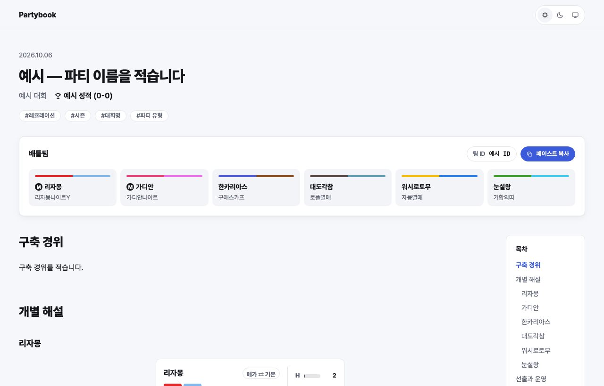

# Partybook

<a href="https://ekfhdtngkr.github.io/partybook/">
  <picture>
    <source media="(prefers-color-scheme: dark)" srcset=".github/preview-dark.png">
    <source media="(prefers-color-scheme: light)" srcset=".github/preview-light.png">
    
  </picture>
</a>

[](https://github.com/ekfhdtngkr/partybook/actions/workflows/pages.yml)
[](https://github.com/ekfhdtngkr/partybook)

포켓몬 챔피언스 파티를 기록하고 공유하는 GitHub Pages 템플릿입니다. [데모 보기](https://ekfhdtngkr.github.io/partybook/)

## 기능

- **샘플 카드** — Showdown 텍스트를 붙여 넣으면 한국어 이름·타입·특성·성격·도구·기술·노력치(SP) 막대가 있는 카드가 됩니다. 포켓몬 이미지는 쓰지 않습니다.
- **원문 복사** — 카드를 드래그하거나 복사 버튼을 누르면 영어 Showdown 텍스트가 그대로 복사됩니다.
- **배틀팀** — 글 안의 샘플을 모아 6마리 요약을 보여 주고, **페이스트 복사**로 팀 전체를 한 번에 복사합니다. 팀 ID도 버튼 하나로 복사합니다.
- **메가진화 전환** — 메가스톤을 든 샘플은 메가 ⇄ 기본 폼을 오갈 수 있습니다.
- **목록 · 태그 · 목차** — 홈에서 태그로 파티를 거르고, 글에서는 읽는 위치를 따라오는 목차를 씁니다. 라이트/다크 모드를 지원합니다.

## 사용 방법

1. 오른쪽 위 **Use this template → Create a new repository**로 내 저장소를 만듭니다.
   사이트 주소는 `https://내아이디.github.io/저장소이름/`이 됩니다.
2. 저장소 **Settings → Pages → Source**를 **GitHub Actions**로 바꿉니다.
3. **Actions** 탭에서 처음 실패한 실행을 **Re-run**합니다. 그 뒤로는 커밋할 때마다 자동으로 배포됩니다.
4. [`_config.yml`](_config.yml)에서 사이트 제목(`title`)·설명(`description`)·글쓴이(`author`)를 바꿉니다. 능력치 이름을 `H A B C D S` 대신 `HP 공 방 …`으로 쓰려면 `showdown.stat_labels`를 `ko`로 바꿉니다.
5. [`_posts/`](_posts/)의 샘플 글을 복사해 내 파티 글을 씁니다. GitHub 웹에서 파일을 추가·수정해도 됩니다.

## 파티 글 쓰기

`_posts/YYYY-MM-DD-이름.md` 파일 하나가 파티 하나입니다. 샘플 글([`_posts/2026-10-06-sample-champions.md`](_posts/2026-10-06-sample-champions.md))과 같은 순서로 씁니다.

### 머리말

```yaml
---
title: "예시 — 파티 이름을 적습니다"
event: 예시 대회
result: 예시 성적 (0-0)
team_id: 예시 ID
tags: [레귤레이션, 시즌, 대회명, 파티 유형]
---
```

| 항목 | 내용 | |
| --- | --- | --- |
| `title` | 파티 이름 | 필수 |
| `event` | 대회 이름 | 선택 |
| `result` | 성적·전적 | 선택 |
| `team_id` | 게임 안 팀 ID (누르면 복사) | 선택 |
| `pokepaste` | Pokepaste 링크 | 선택 |
| `source` | 원문 링크 (번역 글일 때) | 선택 |
| `tags` | 레귤레이션 · 시즌 · 대회명 · 파티 유형 | 선택 |

태그는 홈의 거르기 버튼이 됩니다. 포켓몬 이름은 샘플에서 자동으로 읽으므로 태그로 적지 않습니다.

### 본문

```markdown
## 구축 경위

구축 경위를 적습니다.

## 개별 해설

### 리자몽


Charizard @ Charizardite Y
Ability: Blaze
Level: 50
EVs: 2 HP / 32 SpA / 32 Spe
Timid Nature
- Heat Wave
- Air Slash
- Solar Beam
- Protect


조정 의도를 적습니다.

- 데미지 계산은 이런 방식으로 기록합니다.

(포켓몬 6마리 반복)

## 선출과 운영

### 기본 선출

- 선발: 리자몽 / 가디안
- 후발: 대도각참 / 한카리아스

기본적인 선출 의도와 운영 방침을 적습니다.

## 결과

| 라운드 | 상대 파티 | 결과 |
| --- | --- | --- |
| 예선 1 | 예시1 | OO |

## 마치며

소감을 적습니다.
```

- `` 안에는 Showdown에서 내보낸 텍스트를 그대로 붙여 넣습니다. 노력치는 챔피언스의 SP(0~32)로 표시합니다.
- `##`·`###` 제목이 목차가 됩니다. 넓은 화면에서는 목차가 오른쪽에 붙어 따라옵니다.
- 한국어 이름 대신 영어가 나오면 Actions 로그의 `한국어 이름 없음 — …` 경고를 보고 [`_data/pokedex/overrides.yml`](_data/pokedex/overrides.yml)에 이름을 추가합니다. 포켓몬 하나는 `species`, 여러 포켓몬에 공통인 폼 이름(예: `Alola: 알로라의 모습`)은 `formes`에 적습니다.
- 지역·성별 폼은 `나인테일(알로라의 모습)`, `대쓰여너(암컷의 모습)`처럼 표시합니다. 비비용 무늬처럼 모습만 다른 폼은 기본 이름(`비비용`)으로 표시하고, 복사되는 원문에는 그대로 남습니다.

### 이미지 넣기

팀 화면 캡처나 대회 사진 같은 이미지를 글에 넣을 수 있습니다.

1. 이미지 파일을 [`assets/images/`](assets/images/)에 올립니다. GitHub 웹에서는 폴더에 들어가 **Add file → Upload files**를 누르면 됩니다.
2. 글에서 다음처럼 씁니다.

   ```markdown
   
   ```

- `relative_url`을 꼭 붙여 주세요. 사이트가 `/저장소이름/` 아래에 열리기 때문에, 붙이지 않으면 배포한 사이트에서 이미지가 깨집니다.
- 대괄호 안의 글은 이미지를 볼 수 없는 사람(화면 읽기 도구)에게 읽어 주는 설명입니다.
- 이미지는 글 폭에 맞게 자동으로 줄어듭니다. 용량을 줄이려면 가로 1600px 이하, `.webp`·`.jpg`를 권합니다.
- 이 템플릿은 포켓몬 이미지를 포함하지 않습니다. 직접 넣는 이미지의 권리는 각 권리자에게 있으니 사용 범위를 확인해 주세요.

## 색 바꾸기

대표 색은 [`assets/css/tokens.css`](assets/css/tokens.css)의 `--brand` 하나만 바꾸면 됩니다(라이트·다크 각각).

## 내 컴퓨터에서 미리 보기

[Jekyll 설치 안내](https://jekyllrb.com/docs/)의 1~2단계로 Ruby와 Jekyll을 설치한 뒤, 저장소 폴더에서 실행합니다.

```bash
bundle install
bundle exec jekyll serve
```

## Credits

- 스타일: [Lism CSS](https://lism-css.com) 1.0.1 — MIT, [`assets/vendor/lism-css/1.0.1/LICENSE`](assets/vendor/lism-css/1.0.1/LICENSE)
- 포켓몬 이름·타입·기술 데이터: [Pokémon Showdown](https://github.com/smogon/pokemon-showdown) — MIT, [`_data/pokedex/LICENSE`](_data/pokedex/LICENSE)
- 글꼴: [Pretendard](https://github.com/orioncactus/pretendard) — SIL Open Font License 1.1 (CDN으로 불러옴)

Pokémon 및 관련 이름은 Nintendo · Creatures Inc. · GAME FREAK inc. · The Pokémon Company의 상표입니다. 이 템플릿은 비공식 팬 도구이며 포켓몬 이미지를 포함하지 않습니다.
